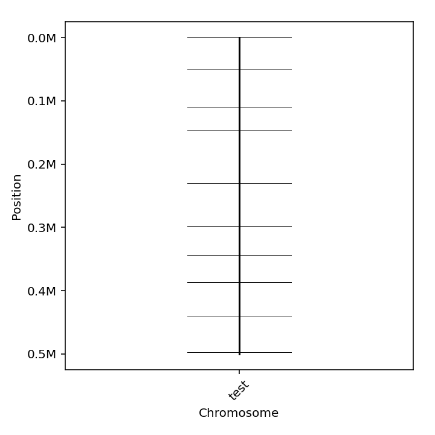
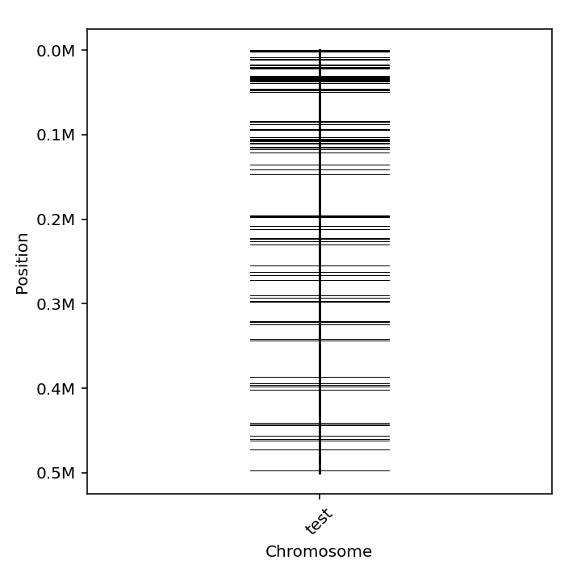

# 'MKDesigner' User Guide
#### version 0.4.2

## Table of contents
- [Outline](#Outline)
- [Install](#Install)
  + [Install via bioconda](#Installation-using-bioconda)
- [Usage](#Usage)
  + [Tutorial](#Tutorial)
  + [Commands](#Commands)
- [References](#References)

## Outline

'MKDesigner' is a tool to design DNA markers for PCR-based genotyping using whole genome resequence data. 
PCR-based genotyping is the most basic genotyping method, and is still an indispensable method for fine mapping and the like.
When performing PCR-based genotyping, it is necessary to identify DNA markers (SSR, InDel, SNP) that are mutated between parental cultivars and design primers to amplify their surroundings.
Primer3 is a convenient tool for designing primers against target sequences, available both on the web and on the local command line[1,2]. Primer-BLAST, which is a combination of Primer3 and BLAST, further searches for specificity within the reference genome and provides primers amplifying only the target sequence[3]. However, it can only be used on the web, and manual input is needed one by one. Therefore, it is very laborious when tens to hundreds of DNA markers are required. 

'MKDesigner' can solve such troubles of marker design. MKDesigner also uses Primer3 and BLAST but It can deal NGS data to design all possible markers and its primers at once.As long as you have the  whole genome resequence data of the parent cultivars, MKDesigner generates a list of primers that amplify your desired DNA marker in just 2 steps.

#### Citation
- Comming soon.

## Install

### Install via bioconda
We recommend that you install the MKDesigner in a dedicated environment.
```
conda create -n mkdesigner mkdesigner
```

#### Dependencies
 - python >=3.8
 - pandas >=2.0.2
 - blast >=2.14.0
 - gatk4 >=4.4.0.0
 - picard >=2.18.29
 - primer3 >=2.6.1
 - samtools >=1.6
 - bcftools >=1.5
 - matplotlib-base

Tools above are installed automatically.


#### Check about packages in dependency
Dependent packages often get errors about shared libraries.
Please check errors of packages below.
```
bcftools --version
samtools --version
```
If you got error like below... 
```
bcftools: error while loading shared libraries: libcrypto.so.1.0.0: cannot open shared object file: No such file or directory
```
you can try a solution like below.
```
cd /home/[USER NAME]/(ex.)miniconda3/envs/(ex.)mkdesigner/lib
ls -l libcrypto.so*
```
For example,
`lrwxrwxrwx ... libcrypto.so -> libcrypto.so.3`
`-rwxrwxr-x ... libcrypto.so.3`
Then, you can make symbolic link to the new version of the shared library.
```
ln -s libcrypto.so.3 libcrypto.so.1.0.0
```

## Usage
### Tutorial
We have a dataset for test.
```terminal:get_test_dataset
git clone https://github.com/KChigira/mkdesigner.git
cd mkdesigner/test
ls
├── lineA_sorted_reads.bam 
├── lineB_sorted_reads.bam
├── test_ref.fasta
└── ...
```

#### (1) 'mkvcf': Haplotype calling 
```
mkvcf -r test_ref.fasta \
      -b lineA_sorted_reads.bam \
      -b lineB_sorted_reads.bam \
      -n lineA -n lineB \
      -p test --cpu 4(appropriately)
```
Then, you will get the directory named 'test_mkvcf/' 
```
test
├── test_mkvcf
|    ├── test_ready_for_mkprimer.vcf
|    ├── command.txt
|    └── intermediate/ 
└── ...
``` 
- 'test_ready_for_mkprimer.vcf' -----Output VCF file
This file will be input file of 'mkprimer'


#### (2) 'mkprimer': Get DNA markers and design PCR primers 
```
mkprimer -r test_ref.fasta \
         -V test_mkvcf/test_ready_for_mkprimer.vcf \
         -n1 lineA -n2 lineB \
         -O test --type SNP \
         --mindep 5 --maxdep 120 --mismatch_allowed 5 --cpu 8(appropriately) \
         --min_prodlen 150 --opt_prodlen 180 --max_prodlen 280 \
         --search_span 140 --primer_min_size 24 \
         --primer_opt_size 24 --primer_max_size 24
```
Then, you will get the directory named 'test_mkprimer/' 
```
test
├── test_mkprimer
|    ├── test_primer_added.vcf
|    ├── for_draw.fai
|    ├── command.txt
|    └── intermediate/ 
└── ...
``` 

- 'test_primer_added.vcf' -----Output VCF file
- 'for_draw.fai' -----Fasta index file (For drawing the positions of markers)
These files will be input file of 'mkselect'

#### (3) 'mkselect': Choose an appropriate number of markers and draw their physical locations
```
mkselect -i test_mkprimer/for_draw.fai \
         -V test_mkprimer/test_primer_added.vcf \
         -n 10 -O test
```
Then, you will get the directory named 'test_mkselect/' 
```
test
├── test_mkselect
|    ├── test.vcf
|    ├── test.png
|    ├── test_primer_data.tsv
|    └── command.txt
└── ...
``` 
- 'test.vcf' -----VCF with only selected markers
- 'test.png' -----Figure of indicates the positions of selected markers
- 'test_primer_data.tsv' -----Useful information of primers and its anpllicons



If you want to get the figure for all markers...
```
mkselect -i test_mkprimer/for_draw.fai \
         -V test_mkprimer/test_primer_added.vcf \
         -n 10000 -O test_all
```


### Commands
```
mkvcf -h
usage: mkvcf -r <FASTA> -b <BAM_1> -b <BAM_2>... -n <name_1> -n <name_2>... -O <STRING>
options:
  -h, --help      show this help message and exit
  -r , --ref      Reference fasta.
  -b , --bam      Bam files for variant calling.
                  e.g. -b bam1 -b bam2 ... 
                  You must use this option 2 times or more
                  to get markers in following analysis.
  -n , --name     Variety name of each bam file.
                  e.g. -n name_bam1 -n name_bam2 ... 
                  You must use this option same times
                  as -b.
  -O , --output   Identical name (must be unique).
                  This will be stem of output directory name.
  --cpu           Number of CPUs to use.
  -v, --version   show program's version number and exit
```
```
mkprimer -h
usage: mkprimer -r <FASTA> -V <VCF> -n1 <name1> -n2 <name2>
         -O <output name> --type <SNP or INDEL>
         [--target <Target position>]
         [--mindep <INT>] [--maxdep <INT>]
         [--min_prodlen <INT>] [--max_prodlen <INT>]
         [--margin <INT>] [--max_distance <INT>]
options:
  -h, --help            show this help message and exit
  -r , --ref            Reference fasta.
  -V , --vcf            VCF file without filtering.
                        Recommended to use VCF made by "mkvcf" command.
                        VCF must contain GT and DP field.
  -n1 , --name1         Variety name 1.
                        Must match VCF column names.
                        This parameter can be specified multiple times to design common markers for multiple varieties.
  -n2 , --name2         Variety name 2.
                        Must match VCF column names.
                        This parameter can be specified multiple times to design common markers for multiple varieties.
  -O , --output         Identical name (must be unique).
                        This will be stem of output directory name.
  -T , --type           Type of variants.
                        SNP or INDEL are supported.
  -t , --target         Target position where primers designed/
                        e.g. "chr01:1000000-3500000"
                        If not specified, the program process whole genome.
                        This parameter can be specified multiple times.
  --mindep              Variants with more depth than this
                        are judged as valid mutations
                        default: 2
  --maxdep              Variants with less depth than this
                        are judged as valid mutations
                        default: 200
  --mismatch_allowed    Primers with more mismatch than this
                        are ignored in specificity check.
                        default: 5
  --mismatch_allowed_3_terminal 
                        Primers with more mismatch than this
                        in 5 bases of 3' terminal end
                        are ignored in specificity check.
                        default: 1
  --unintended_prod_size_allowed 
                        Primer pairs producing unintended PCR product which is shorter than this
                        are ignored in specificity check.
                        default: 4000
  --min_prodlen         Minimum PCR product length.default: 150
  --max_prodlen         Maximam PCR product length.
                        default: 280
  --opt_prodlen         Optical PCR product length.
                        default: 180
  --margin              Minimum distance from 3' terminal of primer to variant.
                        default: 5
  --search_span         Intervals to search for primers upstream and downstream variants.
                        default: 140
  --primer_num_consider 
                        Primer number considering in primer3 software.
                        default: 3
  --primer_min_size     Minimum primer size
                        default: 18
  --primer_max_size     Maximum primer size
                        default: 26
  --primer_opt_size     Optical primer size
                        default: 20
  --cpu                 Number of CPUs to use.
  -v, --version         show program's version number and exit
```
```
mkselect -h
usage: mkselect -i <FASTA Index file>
         -V <VCF with Primer> -n <INT>
         -O <STRING>
         [-t <Target position>]
         [-d <TSV with marker density infomation>]
         [--avoid_lowercase]
options:
  -h, --help          show this help message and exit
  -i , --fai          Index file (.fai) of reference fasta.
  -V , --vcf          VCF file with primers.
                      This file must be made by "mkprimer" command.
  -n , --num_marker   Number of markers selected.
  -O , --output       Identical name (must be unique).
                      This will be stem of output directory name.
  -t , --target       Target position where primers designed
                      e.g. "chr01:1000000-3500000"
                      This parameter can be specified multiple times.
  -d , --density      TSV file with marker density infomation..
                      This file must be formatted as "test/density.tsv".
  --mindif            Set minimum differences
                      of PCR product length between alleles.
                      For SNP marker, this must be 0.
  --maxdif            For indel marker, set maximum differences
                      of PCR product length between alleles.
  --avoid_lowercase   Select only primers written by uppercase.
                      Lowercase may mean repeat sequence.
  -v, --version       show program's version number and exit`
```


## References
[1] Untergasser A, Cutcutache I, Koressaar T, Ye J, Faircloth BC, Remm M and Rozen SG.
Primer3--new capabilities and interfaces.
Nucleic Acids Res. 2012 Aug 1;40(15):e115.
[2] Koressaar T and Remm M.
Enhancements and modifications of primer design program Primer3.
Bioinformatics 2007;23(10):1289-1291.
[3] Ye, J., Coulouris, G., Zaretskaya, I. et al. Primer-BLAST: A tool to design target-specific primers for polymerase chain reaction. BMC Bioinformatics 13, 134 (2012). 

